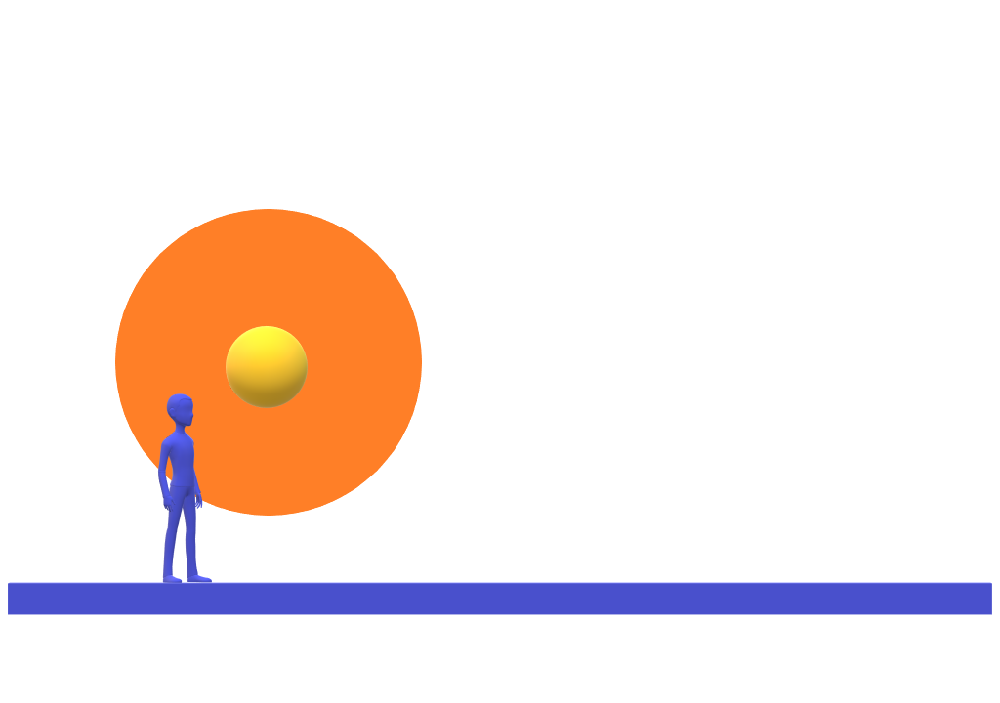
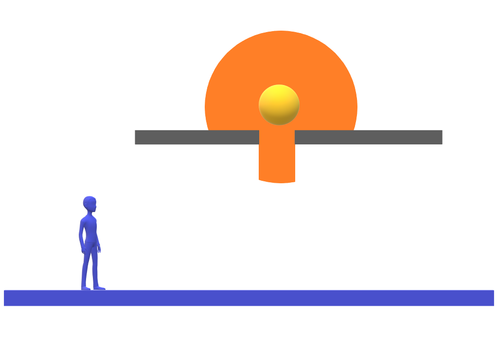
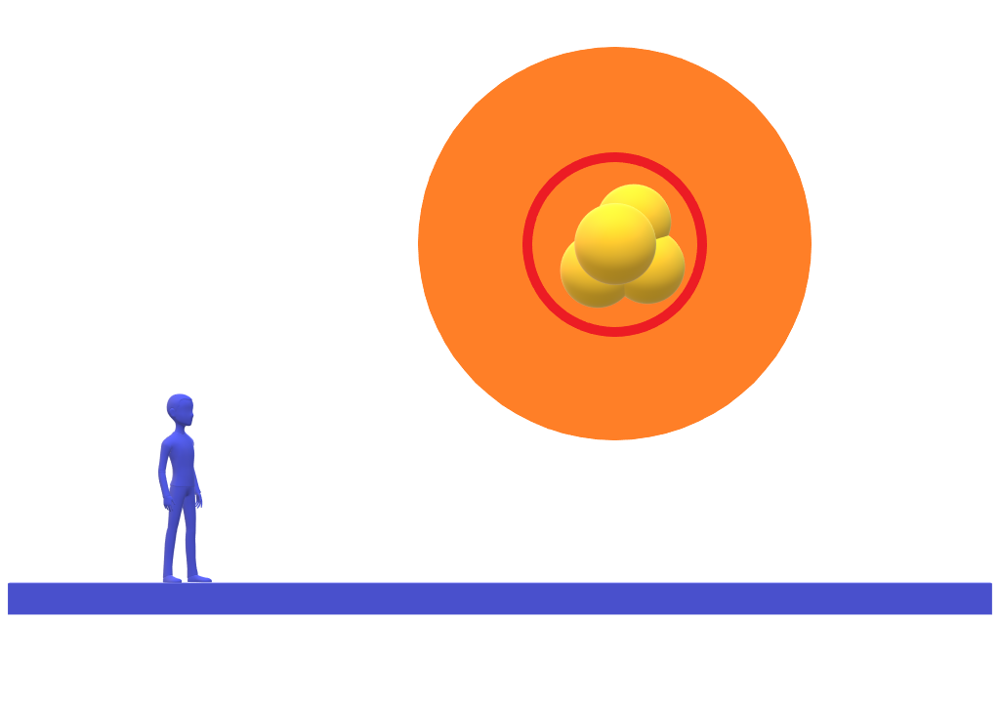

# This document will have everything related to the playable character (HOPE).

## HOPE:

Hope is a lively source of light.

The level designer should be able to tweak the raduis of the light source and influence *$HopeLightRaduis*

- Controlled by the $(Right ThumbStick)/(Mouse)$

---

## Hope should not get close to the player

When hope get close to the player, distance less than $HopeLightRaduis, the screens get white.

When hope get close to the player, distance less than $HopeCloseRaduis, the player restarts the game.

The level designer should be able to tweak the raduis of the close raduis rule *$HopeCloseRaduis*

---

## Hope should not be able to go through certain objects

Hope shouldn't be able to pass through obstacles.

Hope's light should be able to pass.

---

## Hope should feel alive

Hope should be able to move a little in the small raduis,
to feel alive.

The level designer should be able to tweak the raduis of the moving raduis *$HopeMovingRaduis*, and the moving speed *$HopeMovingSpeed*.

---