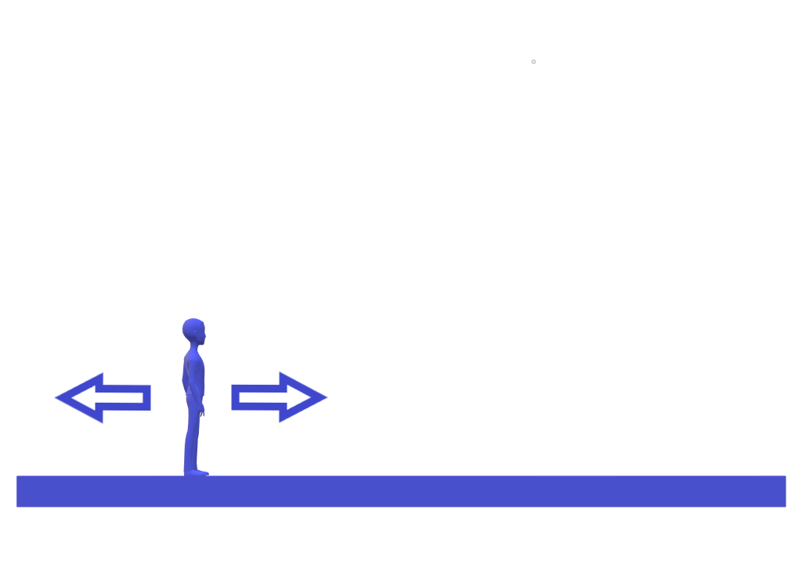

# This document will have everything related to the playable character.

## Player should be able to move the character

The player should be able to move the character left and right.

The level designer should be able to tweak the speed using *$CharacterMoveSpeed*

- Controlled by the $(Left ThumbStick)/(AD)$

---

## Player should be able to make the character jump

The player should be able to make the character jump.

The level designer should be able to tweak the jump heigh using *$CharacterJumpHeight*

- Controlled by the $(South Button)/(Space)$

---

## Player should be able to make the character push objects

The player should be able to make the character push objects.

Objects should be ***distictable*** and of ***small size***.

Objects should be movable from both sides.

*$CharacterMoveSpeed* should be multiplied by a factor *$CharacterPushingFactor*

- Controlled by the $(Right Trigger)/(Left CTRL)$

---