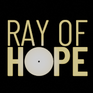

# Ray Of Hope
### A Game about the recovery journey of a young kid.
3D side scroller game made in Unreal.

## Important links
1. [Trello board](https://trello.com/b/8vRMOuFt/ray-of-hope)
2. [Design document](Production/DesignDocuments/README.md)
3. [Assets Naming](https://github.com/Allar/ue5-style-guide)
    * [More engine assets naming](https://docs.unrealengine.com/4.27/en-US/ProductionPipelines/AssetNaming/), [More naming](https://www.tomlooman.com/unreal-engine-naming-convention-guide/)